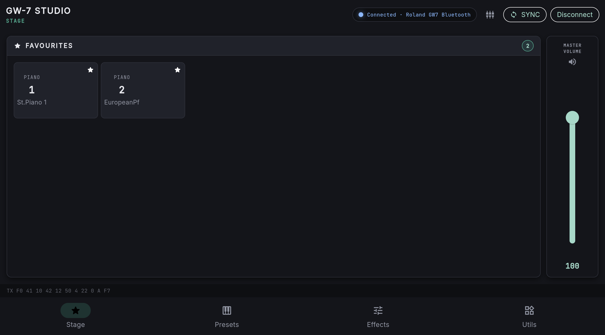
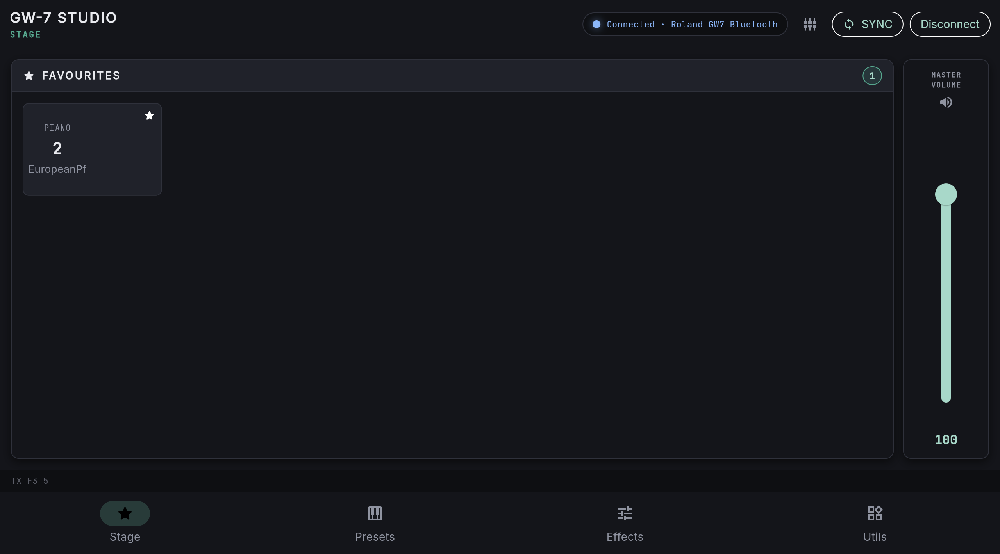
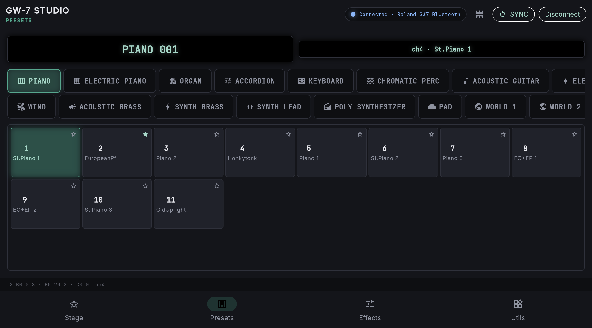
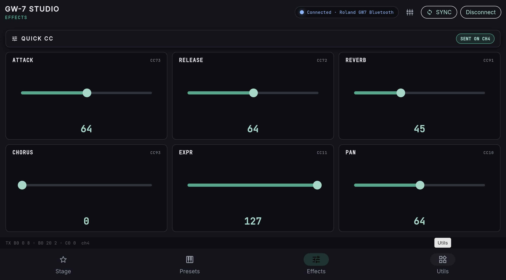
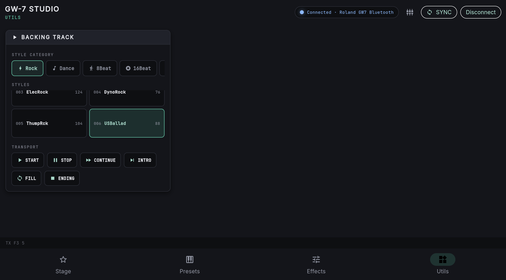

# GW-7 Studio — User Guide

GW-7 Studio is a control application for the **Roland GW-7** arranger keyboard.
It lets you select tones, control effects, launch accompaniment styles and keep
your favourite setup — all from a tablet, a phone or a web browser.

## Requirements

- A powered-on **Roland GW-7**.
- A **GW-7 BLE MIDI bridge** connected to the keyboard (the bridge that turns
  wireless MIDI into signals the keyboard understands).
- The app installed (Android) or opened in the browser:

  - **Android:** install the APK from the repository's *Releases* section.
  - **Browser:** open `https://benlop27.github.io/gw7-suite/`.

## Connecting to the keyboard

1. Power on the BLE bridge and the keyboard. The bridge advertises itself as
   **"Roland GW7"**.
2. Open GW-7 Studio. The app scans for the bridge automatically on startup.
3. Tap **Connect** in the top bar if it did not connect on its own.

When the connection succeeds, the top bar shows **"Connected · Roland GW7
Bluetooth"** and the status indicator turns green.

> If the app does not find the bridge, use the **Choose MIDI device** button
> (plug icon) to open the list of available MIDI devices and pick the bridge
> manually.

## The top bar

At the top of the screen you always see:

- **Connection status:** an indicator with the *Connected / Not connected* message.
- **Choose MIDI device (plug icon):** opens the list of MIDI devices.
- **SYNC:** sends the whole current app setup (tone, volume, effects, etc.) to
  the keyboard in one go.
- **Connect / Disconnect:** connect or disconnect the keyboard.

At the bottom of the screen, a text line shows the last MIDI message sent (for
example `TX B0 00 08 · B0 20 02 · C0 00 ch4`). This is useful to confirm the
commands are reaching the keyboard.

## The Stage tab

Your main working panel. It has two sections:

- **Favourites:** shortcuts to your favourite tones. Presets you starred with ★
  on the Presets tab appear here. Tap one to select it instantly.
- **Master Volume:** overall keyboard volume control (0 to 127).

## The Presets tab

Here you choose the tone the keyboard plays.

1. Pick a **category** in the panel's top bar (PIANO, ELECTRIC PIANO, ORGAN,
   BASS, PAD, etc.).
2. Tap a **tone** in the grid to select it. It is sent to the keyboard immediately.
3. Use the **★** on each tone's corner to add it to *Favourites*.

At the top of the panel there are two LCD displays: the first shows the bank and
tone number (e.g. `PIANO 001`) and the second the channel and tone name (e.g.
`ch4 · St.Piano 1`).

> Tones are sent as bank (CC00/CC32) + program change on the channel configured
> by the app (channel 4 by default).

## The Effects tab

Quick effect controllers, sent as *Control Change* (CC) messages on the active
channel:

| Control | CC message |
| --- | --- |
| ATTACK | CC73 |
| RELEASE | CC72 |
| REVERB | CC91 |
| CHORUS | CC93 |
| EXPR | CC11 |
| PAN | CC10 |

Each control has a 0–127 slider. Move the slider and the change is sent to the
keyboard right away. The **SENT ON CH4** label shows the send channel.

## The Utils tab

Control of the GW-7's **backing track** (accompaniment):

1. Pick a **style category** (Rock, Dance, Jazz, Latin, 8Beat, etc.).
2. Select a **style** from the list (e.g. `001 SteadyRk 73`). The number is the
   style and the last number is its tempo.
3. Use the **transport buttons** to control the accompaniment:

   - **START:** starts the accompaniment.
   - **STOP:** stops it.
   - **CONTINUE:** resumes from where it stopped.
   - **INTRO:** launches the style from the intro.
   - **FILL:** fill-in.
   - **ENDING:** ends the accompaniment.

## Tips

- Tap **SYNC** after adjusting several controls to re-send the whole state to
  the keyboard in one go.
- On connect, the app automatically re-sends the last saved setup, so the
  keyboard recalls your setup from last time.
- If the keyboard does not respond, check the bottom line of the screen: if no
  `TX ...` appears, the MIDI connection is not active — reconnect with
  **Connect**.
